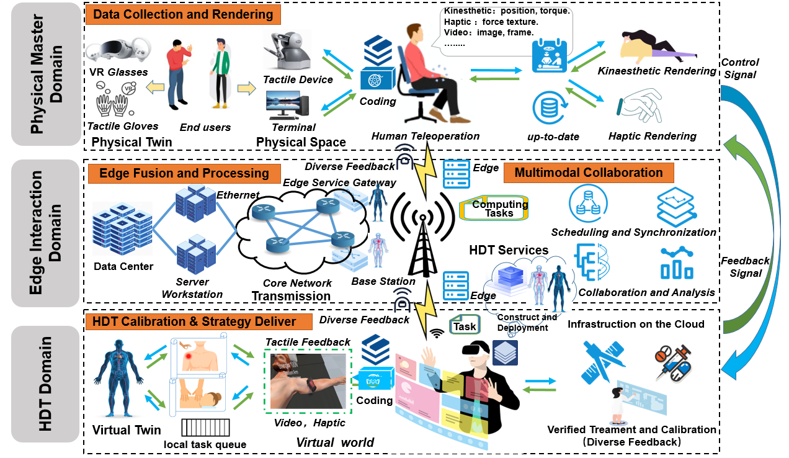

About Me
======
I am an autumn doctoral student in Computer Science and Technology at Nanjing University of Aeronautics and Astronautics, China. I am honored to have received an offer to join [Professor Yi](https://www.smilinnet.com/changyan/)'s SmilinNet (Intelligent Mobile Innovation Networking) research group. My research focuses on **Tactile Internet** and edge intelligence (see our recent [magazine paper](https://ieeexplore.ieee.org/document/10769555?source=authoralert). This involves exploring the integration of **network technologies** including multi-objective optimization, network optimization, and human digital twins. The Tactile Internet represents a disruptive networking paradigm with transformative potential across human activities – from healthcare (particularly physical therapy) to manufacturing. Our research specifically investigates human-in-the-loop interaction systems, integrating digital twins, cyber-physical systems, large language models (LLMs), and edge intelligence. More relevant information can be found in our magazine documents. **If you’re interested in collaboration or discussion, please reach out via email or WeChat**. I look forward to meaningful dialogue and exploring new opportunities – where there’s a will, there’s a way to achieve extraordinary outcomes together.

  

Biography
======
Hao Xiang has been with the College of Computer Science and Technology, Nanjing University of Aeronautics and Astronautics (NUAA), China, as Phd student, from Prof. YI. since September 2022. From September 2019 to August 2022, he worked as a postgraduate in the College of information science and technology, Tibet University, China. He obtained Master's degrees from Tibet University in 2022, under the supervision of [Prof. zhicheng Dong](https://www.tuatrc.com:2021/). His recent research interests multi-objective bayesian, mechanism design, and decision making for various networking systems and services including:
  - Tactile Internet
  - Edge Computing and Edge Intelligence
  - Human Digital Twin

Experience
------
 - Phd Student: Fall 2022 to Present，College of Computer Science and Technology, Nanjing University of Aeronautics and Astronautics (NUAA), China.
 - Part Time Teacher: Fall 2020 to Summer 2025， Lecturer Course QT Project Training and Python Data Analysis，Xinjiang University, Sichuan University, Panzhihua College, Southwest Jiaotong University Enterprise Training Tutor，China.

Featured Publications
------
**Journal/Magazine**：
- [J3] **Hao Xiang**, Tong Zhang and Changyan Yi, ''An Optimization of Feedback Signal Transmission and Reconstruction for Tactile Internet: A Multi-Objective Bayesian Approach'', IEEE Transactions on Network Science and Engineering, accepted. 2025.
- [J2] **Hao Xiang**, Kun Wu, Jiayuan Chen, Changyan Yi, Jun Cai, Dusit Niyato, and Xuemin (Sherman) Shen, "Realizing Immersive Communications in Human Digital Twin by Edge Computing Empowered Tactile Internet: Visions and Case Study," in IEEE Network, vol. 39, no. 4, pp. 271-279, July, 2025.
- [J1] Zhe wen Li, Jing Wang, **Hao Xiang**, Ying Tian, Design and Development of Tour Guide Aircraft Support Software Based on Educational Robots ", Innovation project participant takes on the role of completing the software Development and publication of papers.

**Conference**：
- [C7] **Hao Xiang**, Tong Zhang, Jiayuan Chen and Changyan Yi, ''Multi-Objective Bayesian Approach for Optimizing Subjective-Objective Performance of Tactile Internet,'' IEEE Global Communication Conference (GLOBECOM), Taipei, Taiwan, Dec. 8-12, 2025.
- [C6] **Hao Xiang**, Tong Zhang, Jiayuan Chen and Changyan Yi, ''Joint Optimization of Feedback Signal Transmission and Reconstruction in Tactile Internet,'' IEEE Global Communication Conference (GLOBECOM), Taipei, Taiwan, Dec. 8-12, 2025.
- [C5] **Hao Xiang**, Zhicheng Dong*, Peng Gu, Yao Wen, Zhijie Xiao, "Research on Recommender System Based on Curiosity Guided ldentity Modification", publication by the AlAM2021, Manchester UK, 2021.
- [C4] Bojun, LI, **Hao Xiang**,Cairang, XiangXiu, Nuo QUN, "Research on State Modeling of Multiple Parsers based on attention mechanis ", publication to thelCHCI2021,China, 2021.
- [C3] PengGu, YingXiao, Zhicheng Dong, **Hao Xiang**, "Yak Object Detection Based on Data Augmentation of Style Transfer Method", publication to the ICESIT2021,China, 2021.
- [C2] Zhijie Xiao, Zhicheng Dong, **Hao Xiang**, "PRSNet: A Masked Self-Supervised Learning Pedestrian Re-ldentification Method", 2022.
- [C1] **Hao Xiang**, Ting Zhang, Zhewen Li,Big data cloud platform server load balancing algorithm based on improved chaotic partition algorithm", Has been published, 2021 International Conference on Applied Science and Modern Engineering, Singapore, 2020.

**Others：**
- **Xiang Hao**, Wei Yi; Wan Yu, Luo Yi; Huang Zhenwei, A network engineering junction box, Chinese Patent: CN207572899U, 2018-07-03.
- The first copyright of elk cloud computing service platform v1.0 based on Big data.
-  Nanjing University of Aeronautics and Astronautics, Kaos Industrial Intelligence Research Institute (Qingdao) Co., Ltd Multi objective Bayesian optimization method for haptic Internet under digital twin system: 202410438676.2 [P]. 2024-07-26.

Selected Honors 
------
 - National Scholarship for Master's Students of the People's Republic of China, 2021.
 - National Scholarship, Ministry of Education of the People's Republic of China, 2018.
 - Special commendation group award at the school level of Tibet University, 2021.
 - Second prize at the school level and provincial level in the China Three Innovations Competition, 2021.
 - Third Prize in Sichuan and Southwest Regions of the China Optoelectronic Design Competition, 2020.
 - Tibet University Graduate Scholarship, 2019, 2022.

Professional Activities
------
- Reviewer
- IEEE Transactions on Mobile Computing
- IEEE Transactions on Network Science and Engineering
- IEEE Internet of Things Journal
- IEEE GLOBECOM
- Youth Editorial Board Member of Applied Artificial Intelligence Research (AAIR) Journal

Hobbies
------
Bastketball, Badminton, Staring, Pragramming, Mountain climbing and Cycling etc.

For more info
------
If you want to learn more, you can add my contact information or try sending an email. Meeting is fate!
